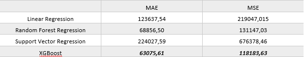

# House Price Prediction

Data Science project that predicts the price of a house based on different aspects of the house (e.g number of bedrooms, location etc.)

## Code and Packages 

**Python version:** 3.9.13

**Packages:** Pandas, Numpy, Sklearn, Matplotlib, Seaborn

## EDA

In this step I did data exploration to better understand the dataset. To check the results open the eda.ipynb

## Examined Models 

The models used for this project are:
- Linear Regression
- Support Vector Regression
- Random Forest Regression
- XGBoost
  
To evaluate the model results I used **Mean Absolute Error and Mean Squared Error.** . Because XGBoost dummy model worked the best, to improve further the model I used **RandomisedSearchCV** to tune the hyperparameters.

## Feature Selection 

Since I had 22 features to train the models I performed feature selection algorithms, to find the most important features. The methods I compared in order to pick the most suitable ones were the following:
- Principal Component Analysis
- Recursive Feature Elimination

I chose to proceed using all features, because the feature selection algorithms didn't provide us with better results.

## Results

The table below shows the results for each regressor when it comes to mae and mse.

  

XGBoost outperformed the other classifiers in all metrics.

